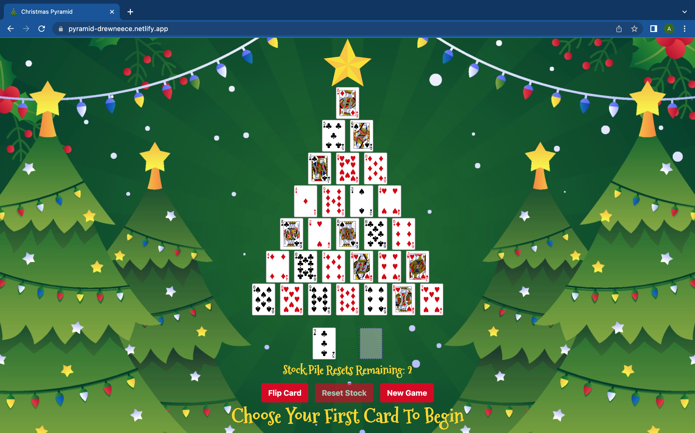

# Christmas Pyramid!

# [Play the game here!](https://pyramid-drewneece.netlify.app/)

Christmas Pyramid is a holiday-themed version of the addition-based solitaire card game Pyramid! Using a shuffled array of 52 playing cards, 28 cards are drawn randomly to be aligned in a 7-row pyramid. The remaining 24 cards will be placed face-up in a stockpile. The goal of the game is to clear the pyramid by selecting 2 cards that add up to a total of 13. You can only play a card that isn't covered up by a card underneath it, so you have to clear the pyramid from the bottom up. If no moves are available on the pyramid, you can flip the card from the stockpile to the waste pile until you get a card you can play, and you can play from the top of either deck. The game is won when the entire pyramid is cleared, but if you go through the whole stockpile 3 times without clearing the pyramid, then the game is over. Each card has another card it can match with, except the King, which can be cleared on the first click because it has a value of 13. The suit of the card is not important for this game, and the card pairs and their corresponding numeric values are shown below:
- Ace (1) & Queen (12)
- Two (2) and Jack (11)
- Three (3) and Ten (10)
- Four (4) and Nine (9)
- Five (5) and Eight (8)
- Six (6) and Seven (7)

# Technologies Used 💾
- CSS
- JavaScript
- HTML
- git

# Ice Box 🧊
- [X] Add 'Directions' button that pops up a modal with game instructions and card pairs when clicked.
- [ ] Add feature to keep a card highlighted when clicked on.
- [ ] Add animation of cards falling off the screen when cleared.
- [ ] Add animation of cards flipping from deck to deck.
- [ ] Add some kind of animation when the game is won or lost.

## [Planning Materials Here](https://docs.google.com/document/d/17oCG1XT-mQnAYSitut-WIHtTjcctXETAVLNu9Ccx3Mg/edit)
